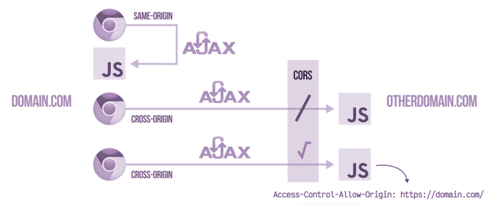

Vamos a ver que es el CORS pero antes tenemos que entender la problemática que puede surgirnos a lo largo de un proyecto.


### Same Origin vs Cross Origin

Podemos tener dos tipos a la hora de categorizar peticiones según el origen:

- Cross origin: Peticiones que se realizan a un dominio diferente desde el que le llamamos.
- Same Origin: Mismo origen.




### CORS

Es una política de seguridad para las peticiones que HTTP que se realizan desde el navegador a un servidor que tienen un dominio diferente al de la página cargada, es decir, las peticiones cross-domain.

Por defecto, cuando usamos este tipo de peticiones ajax los recursos que estén situados en otros dominios tienen protección del cors por lo que no podemos acceder.

La solución suele ser la de incluir en la cabecera de la respuesta la propiedad **Access-Control-Allow-Origin** para indicar el dominio que tiene acceso a la misma 


```
Access-Control-Allow-Origin: https://domain.com/
```

 
Generalmente veremos muchos (*****) ****que sirven para dar acceso a cualquier dominio.

Cuando estemos trabajando en desarrollo podemos utilizar la extensión de chrome:

https://chrome.google.com/webstore/detail/allow-cors-access-control/lhobafahddgcelffkeicbaginigeejlf

Esta extensión deshabilita el CORS pero tenéis que tener claro que solo funciona en nuestro navegador.