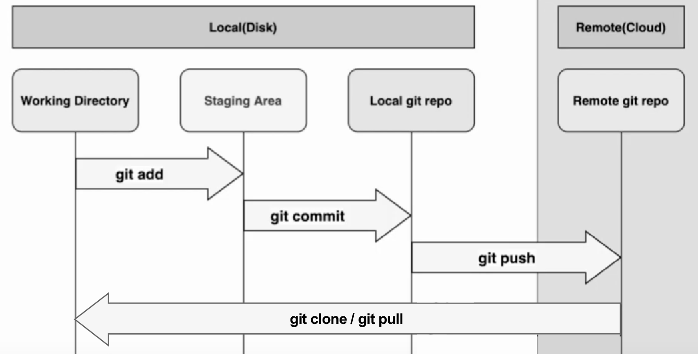

A lo largo del prework vimos como trabajar con GIT, vamos a revisarlo:

### git init

Con este comando comunicamos al control de versiones que va a ser gestionado por git. Este comando crea una carpeta git oculta, con una serie de contenido a nivel de implementación que nos permiten gestionar las versiones.


```bash
git init
```


### git clone

Imaginaros que en vez de empezar un proyecto de cero, entramos en un equipo de trabajo con un proyecto ya iniciado. El comando GIT clone noes permite realizar una copia completa y empezar a trabajar en local ese proyecto.
  

```bash
git clone
```


### git status

El comando git status nos da información sobre el estado actual del repositorio. Que ficheros hemos tocado, en que rama estamos trabajando…

  
```bash
git status
```
 

### git add

El comando git add nos permite añadir ficheros al stage, listos ya para cuando queramos crear un commit y posteriormente poderlos añadir a l repositorio remoto.
  

Opción 1: Por nombre de ficheros 


```bash
git add nombre1.html nombre2.js
```


Opción 2: Todos los cambios 


```bash
git add - A

git add --all
```


Es importante que si después de subir a fase stage un archivo lo modificamos, seamos conscientes de que estos últimos cambios no se van a subir a menos que volvamos a hacer un git add


### git commit

Una vez tenemos los ficheros que queramos subir en fase stage, hacemos nuestro commit, incluyendo un mensaje con los cambios que hemos realizado:
 

```bash
git commit -m "Nuestro primer commit del proyecto"
```
 

Os va a parecer raro, pero si queremos eliminar un fichero, tendremos que incluir con **git add**  ese cambio de eliminación de fichero. Con el comando **git restore** volveríamos atrás y se desharía la eliminación del fichero, descartando los cambios.


### git push

Una vez hayamos hecho uno o varios commits, haremos un git push para subir todos estos cambios al repositorio remoto y que los compañeros de trabajo puedan ver los cambios.


```bash
git push
```
   

### git pull

Del mismo modo, para que nosotros veamos los cambios de los compañeros, haremos un git pull. 


```bash
git pull
```


Con estos comandos, cubrimos la operativa básica del flujo de trabajo:

