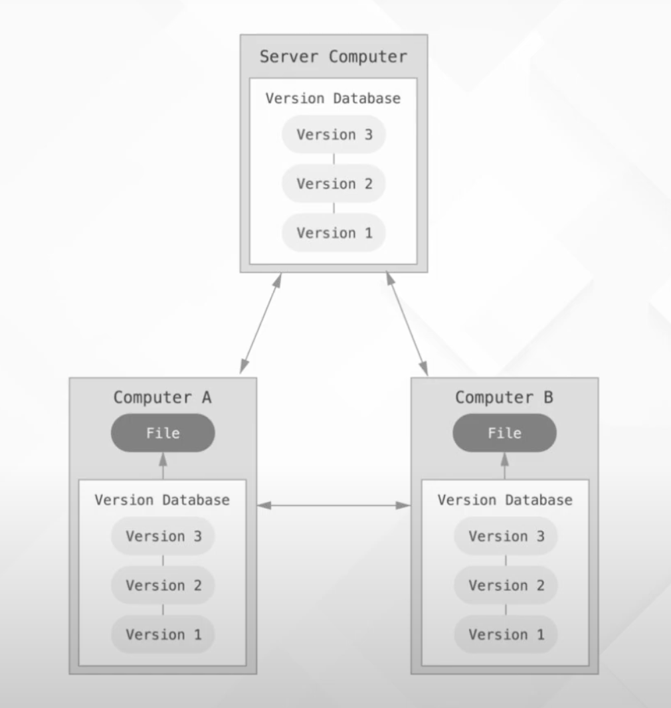

Una vez vista la base de HTML, CSS y JS volvemos a GIT, para repasar la forma en la que tenemos que trabajar con ella. 

En el pre-work vimos como instalarlo, tanto en windows como en mac e hicimos la configuración inicial. Del mismo modo, aprendimos a usar Github. 

Antes de avanzar, remarcar y tener claro que: 

### GIT

**GIT** es una herramienta de control de versiones que permite a varios desarrolladores trabajar sobre un mismo proyecto. GIT tiene un control absoluto de todos los cambios que se han realizado en el proyecto, lo que nos ayuda en caso de error, ya que podemos volver a versiones en las que no existía el fallo y ver los cambios que lo han producido.

### GITHUB

Github lo hemos utilizado también bastante a lo largo de todo este máster, y el enfoque del mismo es hacer de repositorio remoto para guardar nuestros proyectos y poder trabajar en paralelo con otros desarrolladores.

A partir de aquí aprenderemos:

- Los comandos básicos
- A trabajar con cambios
- Las Ramas y la metodología Git Flow de trabajo
- A hacer Merge Request
- Una serie de conceptos avanzados
