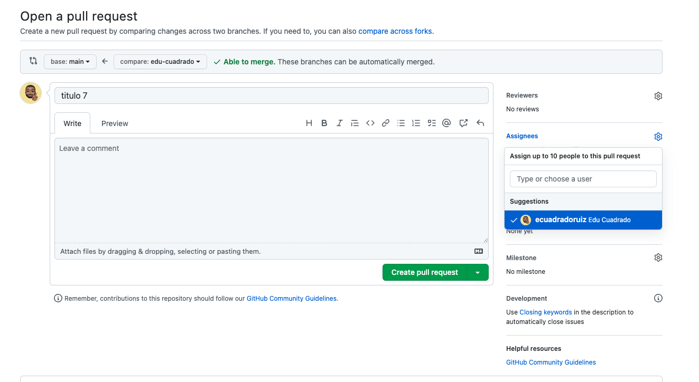
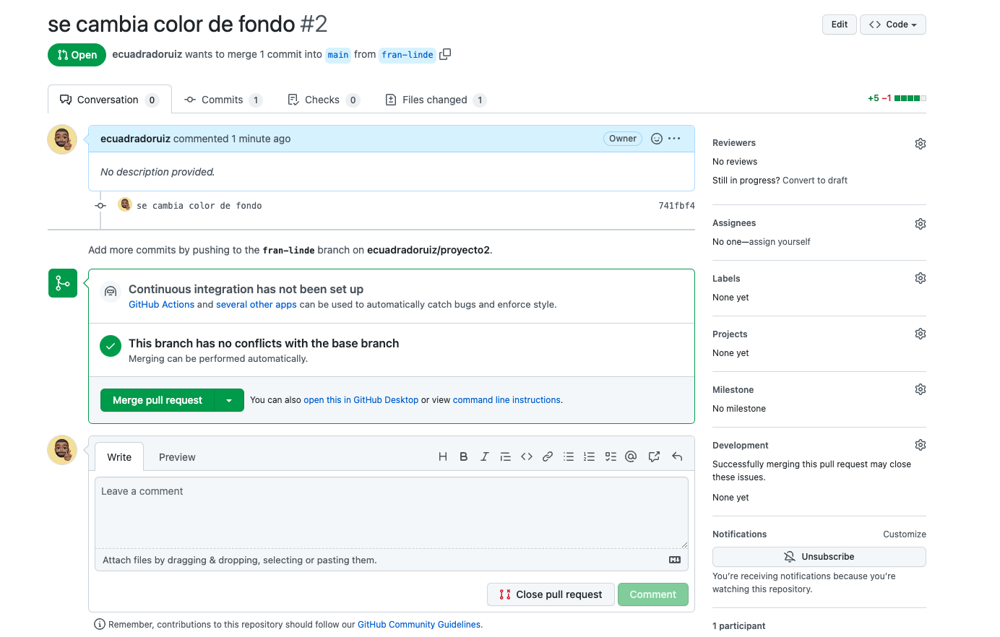

**PULL REQUEST**

Imaginaros que ya hemos terminado nuestra funcionalidad en la rama y queremos unificar esa funcionalidad en desarrollo. Por lo general será necesario crear una pull request para que los compañeros y responsables revisen el desarrollo y validen ese merge.



Crearemos una pull request dando la información necesaria para que los compis puedan revisarla.



Los compañeros podrán validar y se procede al merge.

**MERGES**

Una vez visto como pedir una pull request vamos a ver si queremos hacer un merge en nuestra rama. Imaginaros que se realiza un merge de otra funcionalidad en development por un compi, y queremos esos cambios en la rama que estoy trabajando.

Para ello estando en mi rama de trabajo haré:


```bash
git merge rama -m "comentario"
```

El objetivo es aplicar los cambios de esa rama que todavía no estaban en mi rama.

Cuando fusionamos ramas, pueden aparecer conflictos. Vienen  precedidos por  ´`<<<<<<<` ´ y ´ `>>>>>>>` ´. Una vez me revise todos los conflictos, haré un git add de los cambios y realizaré un commit. Este commit tiene que tener nomenclatura especial para que sea fácil identificarlo:


```bash
git commit -m "Merge branch rama into rama"
```