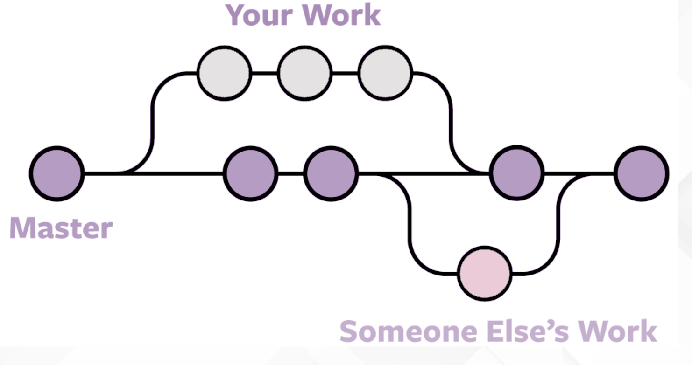

## RAMAS

A la hora de trabajar con git/github hemos visto que siempre que trabajábamos había por ahí un símbolo de la rama **main**. Pero, ¿qué son las ramas?

Las ramas son una bifurcación del código que nos permite trabajar en equipos y aislar funcionalidades.




## ¿COMO CREAR RAMAS Y TRABAJAR CON ELLAS?

Podemos crear las ramas desde github o en local

- LOCAL

Con **git branch** creamos la rama


```bash
git branch nombre
```

Con git checkout nos posicionamos en ella 


```bash
git checkout nombre
```


Alternativa rápida (crea y posiciona)


```bash
git checkout -b nombre
```


Para hacer un push de la rama al repositorio remoto


```bash
git push -u origin nombre
```
  

- GITHUB

Crearemos la rama desde la web de github.

Para que el repositorio local se entere de la nueva rama habrá que usar:


```bash
#Opción 1 (trae las referencias)
git fetch

#Opción 2 (se baja toda la info)
git pull
```