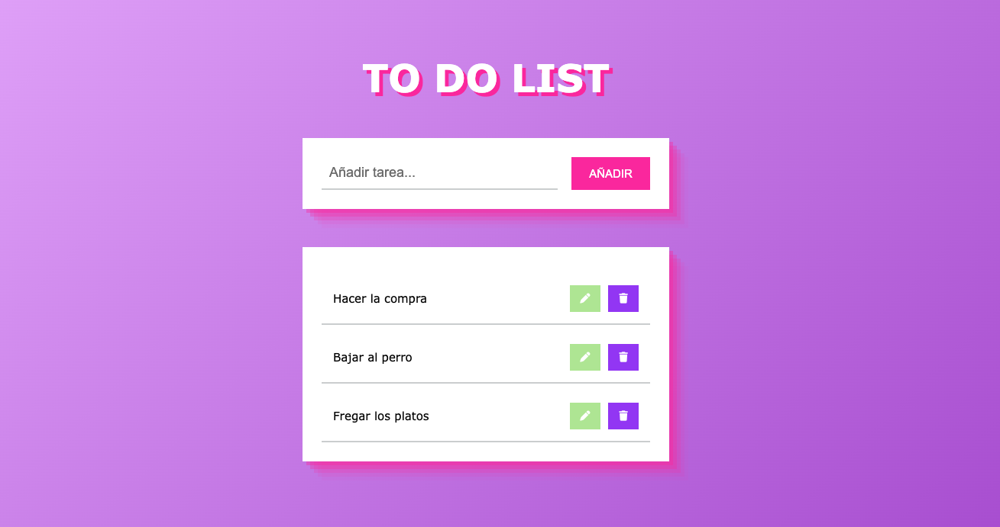

Llega el momento de la tarea y esta semana toca una TO DO LIST

Vamos a practicar el local storage, para ello tenemos que crear este programa que guarde las tareas y nos permita trabajar sobre ellas.

- Funcionalidad
    - Añadir tarea
    - Eliminar tarea
    - Marcar tarea como realizada
    - Opcional: Edición de la tarea
- Diseño
    - Font family → Verdana (es una save font por lo que vale para todos los ordenadores, no hay que descargarla.
    - Iconos de fontawesome
    - Fondo: `background: linear-gradient(135deg, #E2B0FF 10%, #9F44D3 100%`
    - Sombra del texto: `text-shadow: 5px 5px 0px rgba(240, 46, 170, 1);`
    - Sombra de los divs: `rgba(240, 46, 170, 0.4) 5px 5px, rgba(240, 46, 170, 0.3) 10px 10px, rgba(240, 46, 170, 0.2) 15px 15px, rgba(240, 46, 170, 0.1) 20px 20px, rgba(240, 46, 170, 0.05) 25px 25px;`
    - Colores:
        - color botón añadir: rgba(240, 46, 170)
        - hover añadir: rgb(147, 19, 100);
        - botón borrar: #953bfb;
        - botón editar: #bde998;
        - color tachado: lightgray;
- Algunos tamaños (No es necesario ir al píxel)
    - El contenedor general tiene un tamaño máximo de 500px y un padding de 10px
    - La letra del título son 50px
    - La letra del input 18px y el del listado 15px
    - Los tamaños de los botones son 40px